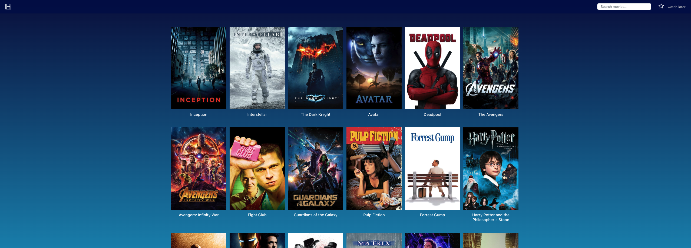

# Movieland

[Demo Link](https://thriving-panda-45da8a.netlify.app)

## Table of Contents

- [Overview](#overview)
- [What's New](#whats-new)

  - [Structure Changes](#structure-changes)
  - [Refactoring](#refactoring)
  - [Additions](#additions)
  - [Unit Tests](#unit-tests)

- [Installation](#installation)
- [Usage](#usage)
  - [Commands](#commands)
- [Project Structure](#project-structure)
- [Testing](#testing)

## Overview

This project, Movieland, is a coding challenge aimed at testing candidates coding abilities in React. After a thorough refactor, structural improvements, and the addition of new features, this version (0.2.1) provides a more robust, maintainable, and scalable codebase. The enhancements also include new and improved unit tests to ensure reliability and performance.

## What's New

### Structure Changes

**Folder Restructure**: The project directory has been slightly changed with new folders added for separation of concerns:

- `src/components/ui`: New folder to house UI components.
- `src/components/pages`: New folder to house Page components.
- `src/context`: New folder for context APIs.
- `src/types`: New folder for typescript types and interfaces.
- `src/utils`: New folder for utility functions.

### Refactoring

- **Code Optimization**: Significant improvements have been made to the efficiency and readability of the code by switching to typescript for type safety.

- **Modularization**: Functions and components have been broken down into smaller, reusable modules using hooks, context and util functions.

### Additions

- `src/components/pages/PageNotFound.tsx`: Page not found component.
- `src/components/ui/Button.tsx`: Reusable regular button component.
- `src/components/ui/Heading.tsx`: Generic HTML heading component eg h1, h2...h6.
- `src/components/ui/Image.tsx`: Image component to render lazy loaded and optimized images.
- `src/components/ui/Loader.tsx`: Loader component to display loading indicator when making API fetch.
- `src/components/ui/Modal.tsx`: Modal component to show trailer.
- `src/components/ui/ModalContent.tsx`: ModalContent component used with the Modal component.
- `src/components/ui/YoutubePlayer.tsx`: YoutubePlayer component handles playing trailers videos.
- `src/context/TrailerContext.tsx`: Handles all trailer, modal display and close logic.
- `src/hooks/useAppDispatch.tsx`: A typed dispatch hook to handle all dispatch actions.
- `src/hooks/useAppSelector.tsx`: A typed selector hook to handle all state selectors.
- `src/hooks/useDebounce.tsx`: A hook to debounce API calls.
- `src/hooks/useGetMovie.tsx`: A hook to fetch movie details.
- `src/hooks/useGetMovies.tsx`: A hook to fetch movies.
- `src/hooks/useInfiniteScroll.tsx`: A hook to handle infinite scroll.
- `src/hooks/useModal.tsx`: A hook to handle modal display and close logic.
- `src/hooks/useTrailerContext.tsx`: A hook that returns the trailer context.

### Unit Tests

- Coverage: All unit test pass with predictable data and outcome.
- Test Suite: Robust test suite using React testing library and jest.

## Installation

Follow these steps to set up the project locally:

1. Clone the repository:

   ```
     git clone https://github.com/sir-radar/coding-assignment.git
     cd coding-assignment
   ```

2. Navigate to this branch:

   ```
     git checkout ft-app-improvements
   ```

3. Install dependencies:

   ```
     npx nvm use && npm install
   ```

4. Start the application:

   ```
     npm start
   ```

5. Open the browser and navigate to http://localhost:3000 and see the application as show below:

   

## Usage

### Commands

- Start Development Server:

  ```
    npm start
  ```

- Run Tests:

  ```
    npm test
  ```

- Build for Production:
  ```
    npm run build
  ```
- Lint Code:

  ```
    npm run lint
  ```

- Format Code:
  ```
    npm run format
  ```

## Project Structure

```
    Movieland
    │
    ├── public
    ├── src
    │   ├── assets
    │   ├── components
    │   │   ├── ui
    │   │   ├── pages
    │   ├── context
    │   ├── data
    │   ├── hooks
    │   ├── styles
    │   ├── test
    │   ├── types
    │   ├── utils
    │   ├── app.scss
    │   ├── App.test.tsx
    │   ├── App.tsx
    │   ├── constants.ts
    │   ├── index.css
    │   ├── index.tsx
    │   ├── react-app-env.d.ts
    │   ├── routes.ts
    │   └── setupTests.js
    ├── .gitignore
    ├── .npmrc
    ├── .nvmrc
    ├── .prettierrc
    ├── eslint.config.js
    ├── package-lock.json
    ├── package.json
    ├── README.md
    ├── tsconfig.app.json
    └── tsconfig.json
```

## Testing

Run the following command to execute the test suite:

```
 npm test
```
